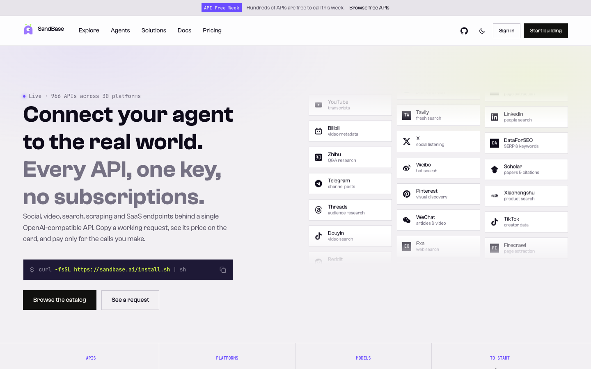
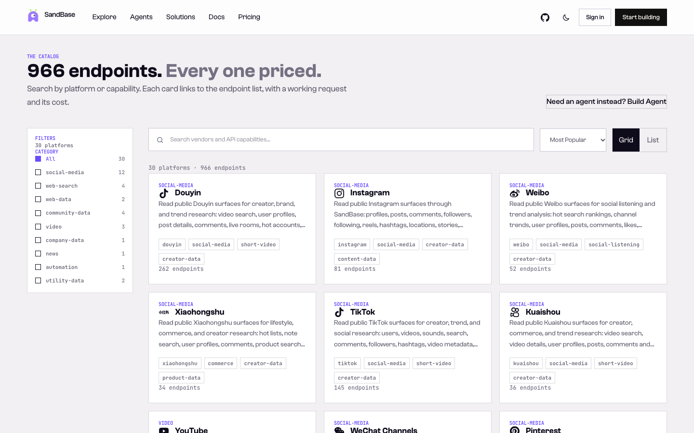
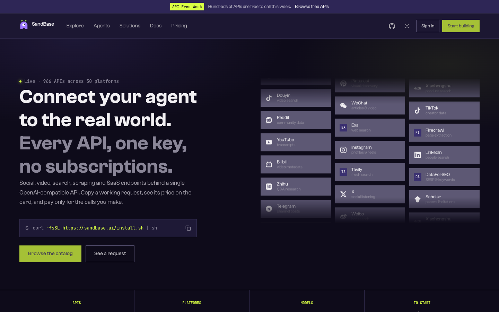

# SandBase APIs — Landing Page

A landing page for the [SandBase](https://sandbase.ai) APIs catalog: **966 real-world
endpoints across 30 platforms**, every one priced, reachable from a product or an agent
behind a single key.

The layout borrows its hero treatment from [monid.ai](https://monid.ai) while staying
inside SandBase's own design system. Both of the live site's themes are implemented —
**light is the default**, matching sandbase.ai, with a header toggle for dark.



---

## Quick start

```bash
npm install
npm run dev        # http://localhost:3000
```

| Script | What it does |
| --- | --- |
| `npm run dev` | Start the dev server |
| `npm run build` | Production build (fully static) |
| `npm start` | Serve the production build |
| `npm run typecheck` | `tsc --noEmit` |

Built with **Next.js 15** (App Router), **React 19**, **TypeScript** and **Tailwind CSS v4**.

---

## Design system

Every colour, font and spacing value is taken from sandbase.ai's compiled stylesheet
(`/_next/static/css/*.css`) rather than eyeballed, for **both** of its themes.

| Token | Light (default) | Dark | Use |
| --- | --- | --- | --- |
| `--color-canvas` | `#f2f0f3` | `#0e0b1a` | Page background |
| `--color-surface` / `--bg-card` | `#fff` | `#241d44` | Cards |
| `--color-surface-alt` | `#e7e4ea` | `#2e2656` | Announcement bar, highlighted tier, CTA panel |
| `--color-ink` | `#0e0b1a` | `#f2f0f3` | Body text |
| `--color-accent` | `#6a4cff` | `#d9ff43` | Eyebrows, links |
| `--button-primary-bg` | `#11110f` | `#d9ff43` | Primary button fill |
| `--border-primary` | `#dbd8df` | `#332d4f` | Hairlines |

Tokens live in three deliberate layers:

| Layer | Location | Purpose |
| --- | --- | --- |
| `@theme` | `app/globals.css` | Tailwind-facing aliases only — `font-sans`, `font-mono`, fluid spacing |
| Structural `:root` | `app/globals.css` | Theme-invariant: fonts, radii, layout rhythm, `--code-*` |
| Theme blocks | `:root` (light) and `[data-theme='dark']` | Everything that flips between themes |

The lists are disjoint, so a value can never drift between two declarations.

#### Reading the live site

sandbase.ai runs **two** themes and **defaults to light**: `html` ships with
`data-theme="light"` and `.light-mode`, and `--color-canvas` resolves to `#f2f0f3`. Its
`:root` block happens to hold the *dark* values, with light layered on via `.light-mode`.
This project inverts that for a simpler cascade — `:root` carries light (the default) and
`[data-theme='dark']` overrides — which produces the same result with one less class to
keep in sync.

**The accent flips with the theme.** Lime `#d9ff43` is the *dark* accent; light mode uses
purple `#6a4cff` with a near-black primary button. Anything hardcoding lime would break
light mode, so components must go through `--color-accent` / `--button-primary-*` rather
than literal values.

#### Theme switching

`components/theme-toggle.tsx` exports the header toggle, a `useTheme` hook, and
`themeInitScript` — a blocking inline script that stamps `data-theme` on `<html>` before
first paint so the page never flashes the wrong theme. Resolution order is stored choice →
`prefers-color-scheme` → light.

#### Code surfaces stay dark

Terminal and command blocks keep a dark background in both themes (`--code-bg`); the live
light theme does the same, setting `--color-plate` to near-black for exactly this purpose.
The `--code-*` tokens are declared once, not per theme, so a command box can never invert
into a pale block with unreadable syntax colours.

### Visual language

Measurements were taken off the live `/apis` page with `getComputedStyle`:

- **Square corners.** Cards, inputs, buttons, chips and tags all compute to
  `border-radius: 0px` on the live site, so `--radius-sm/md/lg` are all `0px`. Only the
  round "live" dot and the price badge stay circular.
- **Eyebrow** — JetBrains Mono 10px/700, uppercase, in the accent colour. It sits above
  each vendor name on its card, showing the raw category slug.
- **Type scale** — display headings 64px/500 with `-1.6px` tracking; vendor names 17px/500;
  body 14px/1.6.
- **Header** — 72px tall; nav reads Explore / Agents / Solutions / Docs / Pricing.
- **Catalog** — a sticky 220px filter rail with square 12px checkboxes, mono labels and
  right-aligned counts; search, sort and the Grid/List toggle sit above the grid.



---

## Brand assets

All three come from sandbase.ai itself rather than being approximated:

- **Logo** — `public/brand/sandbase-logo.png`.
- **Clash Grotesk** — the live site self-hosts a variable woff2 (weight 200–700) at
  `/ClashGrotesk-Variable.woff2`. The same file ships in `public/fonts/`, declared via
  `@font-face` and preloaded, so rendering matches exactly and the display face carries no
  third-party CDN dependency. JetBrains Mono is the one face the live site still pulls from
  Google Fonts, so it does the same here.
- **Vendor brand marks** — 26 official 24×24 paths extracted from sandbase.ai's own client
  bundle (webpack chunk 5068, module 31679) into `lib/vendor-icons.ts`, together with the
  vendor→mark mapping the live catalog uses (`douyin` → TikTok mark, `twitter` → X mark,
  `scholar` → Google Scholar mark). They cover 19 of the 30 catalog platforms. The
  remaining 11 — `lemon8`, `xigua`, `pipixia`, `toutiao`, `dataforseo`, `firecrawl`,
  `agentbody`, `cloudsway`, `exa`, `sandbase`, `tavily` — have no mark in that bundle and
  fall back to a monogram tile via `components/vendor-logo.tsx`.

---

## Data

`lib/vendors.ts` is the single source of truth for the catalog: 30 platforms with
descriptions, tags and endpoint counts copied from the live `/apis` page.

`TOTAL_ENDPOINTS` and `TOTAL_PLATFORMS` are **derived** from that list and consumed by the
hero, stats strip, catalog heading, footer, CTA, quickstart sample output and the document
title. No headline number is hardcoded, so copy cannot drift from the data.

---

## Links

This project only owns `/`. Every destination it links to lives on the real site, so all
outbound paths resolve through `sb()` in `lib/vendors.ts` (`https://sandbase.ai` + path).
Nothing points at a route that does not exist here, so no link can dead-end on a 404.

---

## Project structure

```
app/
  layout.tsx        fonts, metadata (title derived from catalog totals)
  page.tsx          section composition + stats strip
  globals.css       design tokens, primitives, marquee animation
components/
  primitives.tsx    logo, announcement bar, header, footer, section header
  theme-toggle.tsx  header toggle, useTheme hook, pre-paint init script
  hero.tsx          hero copy + monid-style scrolling tool wall
  catalog.tsx       search / category filter / sort / grid-list toggle
  quickstart.tsx    Discover → Run → In an agent, with simulated output
  sections.tsx      three ways in, pricing, FAQ, final CTA
  vendor-logo.tsx   official brand mark with monogram fallback
lib/
  vendors.ts        catalog data, derived totals, hero wall, link helper
  vendor-icons.ts   26 extracted brand marks
public/
  brand/            logo
  fonts/            Clash Grotesk variable woff2
docs/
  images/           screenshots used by this README
```

---

## Implementation notes

Two details that are easy to get wrong:

**Seamless marquee.** Each column of the hero wall renders its list twice and translates
`-50%`, so the halfway point must be exactly one full copy. Flex `gap` on the track adds a
trailing gap that shifts that point by 12px and makes the loop visibly jump — each half is
therefore wrapped in its own container owning its internal gap and padding.

**Grid overflow.** Long unbreakable strings (`sb agents create --tool …`) force grid items
wider than their track, because grid children default to `min-width: auto`. Cards in a grid
carry `min-w-0` so those strings truncate instead of pushing the page wide.

`prefers-reduced-motion: reduce` disables the marquee and all transitions.

---

## Screenshots

Two themes, light first (the default):

| Light | Dark |
| --- | --- |
|  |  |

The catalog and the full set, captured at 1440×900 and 390×844, live in `.preview/`
(git-ignored).

---

## Status

This is a front-end prototype. The catalog is static data, and the quickstart outputs are
illustrative rather than captured from a live request. Two details are assumptions rather
than verified facts, and should be confirmed before wiring up a backend:

- the `@sandbase/sdk` package name and call shape
- the `api.sandbase.ai` hostname and path structure
